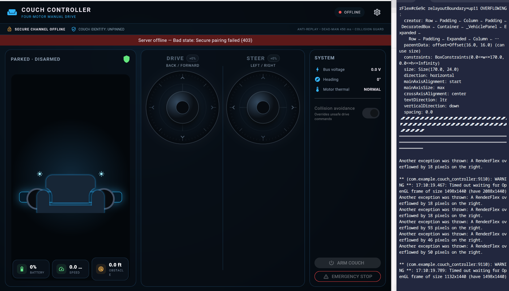

# Couch Controller Secure Advanced

A secure Flutter control station and Python simulation stack for a four-motor experimental couch rover. The project now supports two distinct operating experiences:

- **Controller Mode** for direct supervised driving with dual spring-return joysticks, speed limits, lighting, horn, arm/disarm, collision guard, telemetry, and emergency stop.
- **Autonomous Mode** for simulation-first missions, follow-leader operation, waypoint planning, multi-camera perception, local mapping, risk-aware trajectory generation, runtime assurance, crowd prediction, and mission-level safety monitoring.



> The autonomous stack is simulation-first. Real-world testing requires an independent safety MCU, physical emergency stop, contactor, brakes, watchdogs, low speed limits, a trained operator, and a closed authorized test area.

## Dual-mode application

### Controller Mode

Controller Mode is the human-operated interface. It provides:

- Dual analog controls for throttle and steering
- Configurable slow, normal, fast, and custom speed presets
- Four-motor telemetry and temperature monitoring
- Battery, speed, obstacle-distance, and connection status
- Headlights, horn, motor lock, and disarm controls
- Collision-avoidance enable/disable state
- Large persistent emergency-stop controls
- Local API, HTTPS, USB HAT, and Bluetooth LE transports

Run the standard controller UI:

```bash
cd flutter_app
flutter pub get
flutter run -d linux -t lib/main.dart
```

### Autonomous Mode

Autonomous Mode is the simulation and supervised-autonomy interface. It is designed around a multi-layer CouchPilot stack rather than a simple grid-path algorithm.

Current research modules include:

- Risk-sensitive MPPI in continuous control space
- CVaR tail-risk optimization
- Belief-state localization uncertainty
- Dynamic obstacle prediction
- Passenger comfort penalties for acceleration, yaw rate, and jerk
- Counterfactual world-model ensembles
- Reachable uncertainty tubes
- Control-barrier braking projection
- Online conformal residual calibration
- Multimodal pedestrian and cyclist intent prediction
- Temporal mission contracts
- Deterministic fault-injection campaigns
- Planner-independent motion vetoes

Run the autonomous dashboard:

```bash
cd flutter_app
flutter pub get
flutter run -d linux -t lib/autonomy_main.dart
```

## Autonomous control pipeline

```text
Cameras / lidar / IMU / wheel encoders / GPS / phone sensors
                         |
                         v
                 Belief-state estimator
                         |
                         v
              Risk-sensitive MPPI planner
                         |
                         v
          Counterfactual dynamics ensemble
                         |
                         v
      Conformal and crowd-risk speed reduction
                         |
                         v
        Reachability runtime-assurance monitor
                         |
                         v
          Temporal mission-contract verifier
                         |
                         v
           Requested motion or safe fallback
                         |
                         v
       Independent safety MCU and motor drivers
```

The optimizer is treated as untrusted. Each command can be reduced, replaced with deterministic braking, or vetoed entirely by independent safety layers.

## Security design

This revision does **not** place a universal symmetric secret inside the Flutter binary.

- **API key at rest:** encrypted with AES-256-GCM.
- **Couch identity:** persistent Ed25519 identity generated on first boot.
- **Pairing:** ephemeral X25519 exchange signed by the couch identity.
- **Identity pinning:** changed identities are rejected after first pairing.
- **Command channel:** HKDF-SHA256 derives per-session AES-256-GCM keys.
- **Replay defense:** sequence numbers and timestamps reject replayed commands.
- **Session lifetime:** sessions expire and must be renegotiated.
- **Transport independence:** the secure envelope can travel over LAN, cloud HTTPS, USB, or BLE.
- **Safety timeout:** stale commands stop motion through the dead-man watchdog.

> For production, use TLS 1.3 as an outer layer and place long-term private keys in a TPM or secure element.

## Backend

```bash
cd sim_backend
python3 -m venv .venv
source .venv/bin/activate
pip install -r requirements.txt

export COUCH_API_KEY="$(python -c 'import secrets; print(secrets.token_urlsafe(48))')"
export COUCH_BIND_HOST=0.0.0.0
export COUCH_IDENTITY_FILE="$PWD/couch_identity.key"
python run.py
```

The first run generates `couch_identity.key` with restrictive permissions.

## Autonomous services

The `autonomous_sim/` directory contains the progressive CouchPilot research services.

Typical setup:

```bash
cd autonomous_sim
python3 -m venv .venv
source .venv/bin/activate
pip install -r requirements.txt
export COUCH_AUTONOMY_API_KEY="dev-autonomy-key"
```

Available runners include:

```text
run.py                     supervised autonomy simulator
run_couchpilot.py          risk-sensitive MPPI planner
run_couchpilot_v3.py       ensemble runtime assurance
run_crowd_api.py           conformal crowd-risk service
run_mission_assurance.py   temporal contracts and fault campaigns
```

Each service remains simulation-only unless explicitly connected through the separate hardware safety chain.

## BLE controller HAT protocol

The Flutter BLE transport discovers:

- Service: `8d7b0001-32ad-4c59-b7f2-5c60a39d8830`
- Encrypted command characteristic: `8d7b0002-32ad-4c59-b7f2-5c60a39d8830`
- Encrypted telemetry characteristic: `8d7b0003-32ad-4c59-b7f2-5c60a39d8830`

The HAT must reassemble frames, enforce maximum sizes, perform the Ed25519/X25519 handshake, decrypt AES-GCM packets, verify ordering, and only then pass normalized commands to the safety MCU.

## Hardware separation

Use at least two processors in a physical build:

1. **Connectivity computer or HAT:** BLE/Wi-Fi, identity keys, encrypted protocol, cameras, planning, and telemetry aggregation.
2. **Independent safety motor MCU:** watchdog, contactor control, current and temperature limits, wheel encoders, bumpers, braking, and hardwired emergency stop.

The network-facing processor must never directly generate unrestricted motor PWM. The safety MCU independently rejects stale, malformed, unsafe, or over-limit commands.

## Project status

The manual controller, secure transport layer, simulation backend, advanced autonomy planner, uncertainty monitors, crowd-risk modules, and mission-assurance tooling are implemented as an evolving research platform. Hardware deployment should proceed only through staged software-in-the-loop, hardware-in-the-loop, closed-course, and low-speed validation.